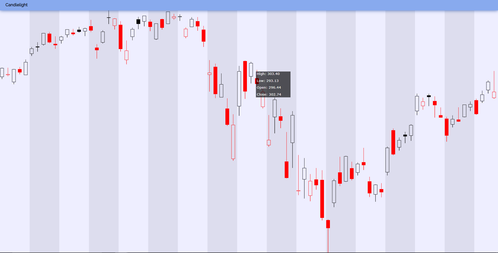

# Candlelight.js
Candlelight.js - a fast, lightweight library for drawing beautiful interactive stock charts for the web.

As of now, Candlelight.js is simply a pure ES6 library built for raw web apps. Support for React/Node will be in the works once current development for ES6 is stable.

## Features
### Clean, easy to imbed stock charts
Candlelight makes incorporating interactive candlestick stock charts into your web projects easy. Embed a stock chart in a mere line or two of code!

### Interactive components
CandleCharts supports plugins for hover and drag events. The default hovering event will display exact details about a given "candlestick" (the day's high, low, open, close).



## Usage
Currently, you can source this script using [jsDelivr](https://jsdelivr.com/) with the following line of code.
```html
<script src='https://cdn.jsdelivr.net/gh/maxzuo/candlelight.js@master/candlelight.js'></script>
```

Alernatively, you can download this repo and include the `candlelight.js` file in the `<head></head>` section of your code, with the following line of code:
```html
<script src='candlelight.js'></script>
```

Candlelight can be accessed globally using the variable name `candle`. To instantiate a `CandleChart` object, run:
```javascript
candle.Chart(width, height)
```

`CandleChart`s have the following methods:
- `loadData(data)`. Where `data` is a `number[][]` in the format `[[High, Low, Open, Close], ...]`.
- `draw()`. Returns an `<svg>` object which is the rendered chart.

## Development
Current development is currently focused on:
- titles and axes.
- adding customizable interactiveness to these charts
- support for displaying volume and dates